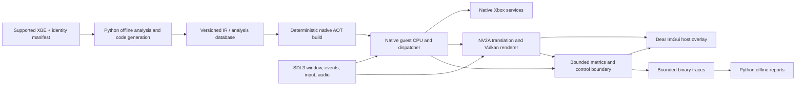

# b2_recomp Architecture, Workflow, Performance, and UI Audit

**Audit date:** 2026-07-22

**Audited revision:** `e34ba0eaf4d4722c156c6064e5ef3f113afce63f` (`Improve live rendering and frontier performance`)

**Scope:** repository structure, recompilation/runtime architecture, build and test workflow, debugging, current performance evidence, Python and SDL3 usage, and a proposed Dear ImGui interface.

**Remediation updated:** 2026-07-23

## Remediation progress

- [x] Local artifact cleanup. Removed approximately 20.28 GiB of generated
  reports, host builds, and stale native source/DLL cache entries while
  retaining the 55 MiB decoded-block database, native manifest, and audio
  cache.
- [x] Exact XBE provenance. `tools/targets/supported_targets.json` now pins the
  whole file, normalized loaded image, certificate, layout, and every actual
  and embedded section hash. Both the live launcher and direct probe reject an
  unknown executable before guest execution; the developer override is
  conspicuous and marks the run unsupported.
- [x] Build and run identity. Presenter builds now carry a content-addressed
  source/shader/compiler/library/artifact manifest. `--skip-build` rejects
  missing or stale artifacts. Every live launch writes a run manifest with Git,
  target, generated-code, configuration, cache, host, build, and result
  identity, and post-run reports reject a probe summary from another run.
- [x] F11 guest-FPS measurement. The presenter now maintains the completed-
  guest-flip sample whether or not F9 is visible. F11 records that guest FPS
  with its flip count and duration, and labels the latest host-frame rate
  separately as presenter FPS.
- [x] Change-driven render resources. Completed flips no longer force a full
  resource scan. Retained binding generations and cached guest-page generations
  trigger a snapshot only when bindings or bound memory actually change.
- [x] Fixed-rate controller delivery. Guest slices retain the last valid state
  and cap controller snapshot filesystem checks at 60 Hz; skipped slice checks
  and actual polls are counted separately.
- [x] Bounded diagnostics. Native-run history preserves the first 8 and latest
  56 records, native edge collection/reporting and callback address timing have
  hard caps, and every truncation or overflow is disclosed in summaries.
- [x] Presenter state and deltas. Normal live transport appends only new packed
  command spans, explicitly marks unchanged resource generations, and retains
  interpreter state, textures, buffers, render targets, descriptors, and
  pipelines while their identities remain valid.
- [x] Controlled overlay-off performance baseline. Run
  `a0e9bb76-365c-4319-a3fc-adbd233f333a` completed normally in 65.432 seconds
  with the exact target and presenter identities, warm caches before and after,
  diagnostics/profiling/audits and CPU fallbacks disabled, and presentation
  depth two. Its F11 snapshot at host frame 2,910 retained a self-verifying
  sample of 23 completed guest flips over 1.001 seconds: **22.986 guest FPS**,
  or 38.3% of the 60 FPS target. At the same workload, guest throughput needs
  approximately 2.61x improvement. The snapshot also recorded 628,548,647
  guest instructions, 0.105 ms latest-frame CPU render time, and 2.345 ms GPU
   time. This is a precise one-second point sample, not a frame-time
   distribution.
- [x] P3 project professionalization. Exact Python and transitive development
  dependencies plus CMake, Ninja, Clang, Vulkan SDK, SDL3, and native artifact
  hashes are locked and validated before builds. A one-command quality gate,
  strict type checking, pre-commit, and Windows Python/native CI are checked in.
  Ten native cases now cover vertex programs and renderer transport, texture,
  dirty-range, pipeline-key, and FPS-sampling boundaries. Presenter entry,
  options, logging, metrics, live transport, NV2A command processing, Vulkan
  device/rendering, retained resources, capture/diagnostics, session
  orchestration, and SDL3 platform ownership are separate modules. README
  operational evidence moved to focused docs, and architecture/build/
  contribution/license/asset policies now define the project boundary.
- [x] Focused project documentation. The README is now a 170-line project
  entry point instead of an operational run log. Initial setup and ordinary
  use live in `docs/GETTING_STARTED.md`; runtime mechanics, build/maintenance,
  diagnostic workflows, profiler protocol, and retained evidence live in
  their architecture, building, debugging, profiling, and validation guides.
- [ ] Controlled overlay-on performance baseline. Deferred until the planned
  P4 host overlay exists; no substitute measurement is being claimed.

## Executive verdict

`b2_recomp` is a technically impressive reverse-engineering prototype wrapped in prototype-grade engineering. The rendering progress is real, the capture/replay discipline is unusually strong, and there is evidence of careful investigation. The project nevertheless does **not** yet have a professional or scalable foundation.

The central problem is not Vulkan, SDL, or a single slow function. It is that offline analysis, guest execution, dynamic recompilation, target-specific repairs, host services, transport, presentation, profiling, and developer tooling have grown into a few enormous Python and C++ files. The repository calls itself a static recompilation, but normal execution still behaves substantially like a Python-orchestrated dynamic binary translator: it discovers frontier blocks during play, emits C++, invokes a compiler, loads DLLs, and promotes them into the running executor. That architecture makes cold start terrible, profiling noisy, correctness difficult to localize, and the runtime much harder to ship than it needs to be.

The foundation contains good ideas, but the current structure is not sound enough to build on indefinitely. Preserve the reverse-engineering knowledge, deterministic artifacts, and validation work. Replace the runtime shape around them.

| Area | Grade | Blunt assessment |
| --- | --- | --- |
| Reverse-engineering method | A- | Strong evidence capture and disciplined replay. |
| Rendering parity | B+ | Impressive progress; validation is ahead of architecture. |
| Runtime architecture | D+ | Too much Python, live compilation, filesystem IPC, and cross-cutting state. |
| Maintainability | D | Several files are effectively subsystems, not source files. |
| Build and reproducibility | F | No coherent build system, dependency lock, or CI contract. |
| Tracked repository hygiene | B | The Git tree itself is relatively small and ignores proprietary/generated data. |
| Local artifact hygiene | F | Tens of gigabytes of reports and caches with weak lifecycle management. |
| Testing | C | Broad Python coverage, but too much source-text testing and too little native behavioral coverage. |
| Debugging | C+ | Powerful forensic tools implemented in a slow, manual, data-explosive workflow. |
| Performance readiness | D | The measurements identify real bottlenecks, but the baseline itself is not trustworthy enough. |

## What is genuinely good

This project is not bad work. It is good research work that has outgrown its scaffolding.

- Guest/host responsibilities are at least conceptually separated.
- Frozen captures, exact command/resource generations, strict replay, and readback comparison are the correct techniques for renderer parity.
- Content-addressed and SQLite-backed caches show good instincts.
- Proprietary game data and most generated artifacts are correctly ignored by Git.
- Vulkan is an appropriate renderer for the low-level control required by NV2A translation.
- The unit suite completed successfully: 502 tests passed in about 56 seconds during this audit.
- The current performance report contains enough stage and boundary data to identify several major costs instead of merely guessing.

Those strengths are worth preserving. They do not excuse the architecture around them.

## Repository shape and cleanliness

The tracked repository is deceptively small: approximately 60 files and 3.98 MiB, but roughly 95,644 lines in total and 90,526 nonblank lines. About 68,683 nonblank lines are implementation and 21,299 are tests. The problem is concentration, not raw repository size.

The worst offenders are:

| File | Approximate size | Problem |
| --- | ---: | --- |
| `tools/playability/playability_probe.py` | More than 22,000 lines | Runtime, target repairs, diagnostics, capture, services, and orchestration collapsed into one module. |
| `runtime/host/vulkan_first_frame.cpp` | 15,901 lines | A “first frame” prototype that became the full presenter. |
| `tools/recomp/x86_lifter.py` | 8,009 lines | Analysis, lifting policy, and emission are too tightly coupled. |
| `tools/recomp/native_executor.py` | 4,211 lines | Runtime dispatch, compilation, caching, DLL loading, and policy in one place. |
| `runtime/xbox/shims.py` | More than 4,500 lines | Xbox services need domain modules and explicit interfaces. |

`VulkanFirstFrameApp` alone spans roughly 10,762 lines (`runtime/host/vulkan_first_frame.cpp:4944-15705`). That is not a class; it is an application hidden inside a class. Likewise, `playability_probe.py` is no longer a probe. These names preserve the archaeology of the project rather than explaining its present architecture.

**Remediation note (2026-07-23):** the historical presenter file is now a
25-line executable/DLL adapter. Presenter methods are defined out of class and
split by responsibility: session/live-reload/pacing (about 2.25 KLOC), Vulkan
device/render/synchronization (3.71 KLOC), textures and retained resources
(2.65 KLOC), diagnostics/readback/capture (1.68 KLOC), and NV2A command support
(3.20 KLOC). A private 652-line runtime header holds the declaration and shared
state. SDL3 platform, shared-memory transport, options, logging, and metrics
reporting are separately owned modules rather than more methods on the
presenter class.

There are 349 unique `TITLE_*` symbols and 1,163 occurrences, plus dozens of title-specific classes/functions in the playability runtime. The title repair fallbacks are disabled by default, which is good, but their presence in the core execution path still makes it difficult to distinguish emulation/recompilation semantics from Burnout-specific compensation.

### Local bloat

The Git tree is not the main bloat problem. The working environment is:

- `reports/`: approximately 17.6 GiB.
- `build/`: approximately 3.25 GiB.
- `reports/local/live/`: approximately 10.35 GiB.
- Playability reports: approximately 6.94 GiB.
- Individual command payloads exceed 1 GiB; `native-live.json` was about 753 MiB, a targeted matrix about 481 MiB, and a render debug report about 380 MiB.

Startup cleanup in `tools/playability/live_test.py` removes selected known files, but it is not a crash-safe generation scavenger. The native cache permits up to 2,048 artifacts and 4 GiB (`tools/recomp/native_executor.py:59`). There is no documented retention policy or first-class clean command.

**Remediation note (2026-07-23):** the immediate 20.28 GiB workspace cleanup is
complete. `tools/project_maintenance.py` now provides budget inspection,
age/count/byte retention, `clean-reports`, and `clean`; destructive operations
require `--apply`, validate every resolved file against a managed root, and
never target `data/local/`.

**Verdict:** orderly as a private research notebook, not orderly as a project another developer could clone, understand, reproduce, and maintain.

## The architectural identity crisis

The public framing suggests a static recompilation. The live architecture is hybrid dynamic recompilation:

1. Python drives guest execution and discovers blocks at the frontier.
2. It interprets or handles uncovered work.
3. It emits native C++.
4. It invokes `clang-cl` during execution.
5. It loads generated DLLs through `ctypes`.
6. It promotes the generated executor and continues.

`NativeResumableExecutor` begins around `tools/recomp/native_executor.py:1516`. The measured cold initial native compile took approximately **188.5 seconds**, with approximately 199.4 seconds of total compile time in the profiled run. That is not a tolerable normal launch path and it makes the product harder to debug, cache, package, secure, and reproduce.

If live promotion is useful for research, keep it as an explicitly selected developer mode. It should not define the shipping runtime. Persist newly discovered frontier information as an input to the next deterministic AOT build.

The target identity should be unambiguous:

- **Offline toolchain:** inspect the supported XBE, produce versioned IR/metadata, emit native code, and build it reproducibly.
- **Native runtime:** execute prebuilt guest code, provide Xbox services, present audio/video/input, and expose bounded diagnostics.
- **Developer fallback:** optional interpreter/live promotion for research, visibly nonrepresentative and excluded from release benchmarks.

## Target provenance is not strict enough

The README reports that 16 of 17 section digests match while `.text` does not. The XBE inspection tooling confirms the expected/actual mismatch. Hundreds of target-specific addresses and assumptions are unsafe without a hard identity gate.

**Remediation note (2026-07-23):** the hard gate is now implemented for live
and direct-probe execution. The supported manifest deliberately records the
known `.text` embedded-digest mismatch but requires the exact audited whole-file
and normalized-image identities, so "mostly matching" is no longer accepted.

Before execution, the project should require an explicit supported-build manifest containing at least:

- Whole-file hash and normalized image hash.
- Region/revision identity.
- Per-section hashes and expected virtual layout.
- Analysis schema/tool version.
- Generated-code build identifier.
- Compatible runtime version.

Refuse unknown images by default. A developer override may exist, but it should print an unmistakable warning and mark every produced report as unsupported. “Mostly matching” is not an acceptable provenance contract for address-sensitive recompilation.

## Build and workflow audit

The workflow is not professional yet.

There is no project-level CMake/Meson/Ninja configuration, Python project metadata and lock file, CI workflow, formatting/linting/type-check contract, pre-commit configuration, contributor guide, or license. `tools/host/first_frame_smoke.py` manually constructs compiler commands and contains environment-specific defaults, including `C:/VulkanSDK/1.4.341.1` and a local LLVM path. The default workflow recompiles the presenter; `--skip-build` trusts the existing binary without a source, compiler, or shader freshness check.

At audit time, the latest performance report predated the current commit, and the presenter executable and some shader/source timestamps did not describe one coherent build. Consequently, the current numbers are useful clues, not a valid performance claim about the audited revision.

The recent Git history also contains commits with tens of thousands of inserted lines. Large prototype imports are sometimes unavoidable, but repeatedly landing subsystem-sized changes as giant commits prevents meaningful review and makes regression bisection nearly useless.

**Remediation note (2026-07-23):** presenter builds now emit and validate a
content-addressed manifest, `--skip-build` rejects stale or unidentified
artifacts, and live runs record build/run identity. Python project metadata,
exact-version runtime/development locks, Windows CI, Ruff/bytecode checks,
synthetic preflight, and first-class maintenance commands are now present.
CMake/Ninja now builds asset-free native tests in debug, release, profiling,
and sanitizer configurations; the optional strict release target also builds
the Vulkan executable, embedded DLL, and source-dependent SPIR-V locally.
The exact native toolchain/artifact lock, ten-case native boundary suite,
strict type gate, pre-commit/CI quality command, and focused project
documentation are now present. Dear ImGui remains a P4 dependency and must be
revision-locked when it is introduced.

### Required professional baseline

1. Add CMake with Ninja presets for debug, release, profiling, and sanitizer builds.
2. Pin native dependencies and the exact Dear ImGui/SDL3 revisions.
3. Add `pyproject.toml` plus a lock file for offline tools.
4. Add CI that builds the native runtime, runs Python and native tests, validates generated artifacts, and performs a small deterministic replay.
5. Adopt formatters, static analysis, and type checking with one documented command.
6. Make every run manifest record Git SHA, dirty state, XBE identity, generated-code ID, executable/shader hashes, compiler and flags, cache state, profile mode, hardware, and warm/cold state.
7. Add `clean`, `clean-reports`, cache inspection, size budgets, and age/count retention.
8. Split operational history out of the 603-line README into focused documentation.
9. Add `LICENSE`, `CONTRIBUTING.md`, and an explicit policy around original-game assets.
10. Prefer reviewable commits that each preserve a buildable/testable state.

## Testing audit

Passing 502 tests is valuable, but the number overstates confidence in the product.

- The suite is almost entirely Python; there is no meaningful native C++ unit-test layer.
- `tests/unit/test_first_frame_smoke.py` reads C++ source and contains hundreds of `assertIn`/regular-expression assertions. These test spelling and implementation layout, not renderer behavior.
- The Python suite can pass even when the native presenter or SPIR-V is stale.
- `tools/playability/preflight_suite.json` references ignored `reports/local` artifacts, so a fresh clone or CI worker cannot reproduce the preflight suite.
- Successful test output still included noisy negative diagnostics such as a failed lossless audit and guest termination. A passing test command should not make the reader decide which failures are expected.

Replace source-text assertions with:

- Native unit tests for resource lifetime, format conversion, tiling, dirty tracking, synchronization, and pipeline-key behavior.
- Golden IR/emitter tests with schema/version checks.
- Small redistributable synthetic command/resource fixtures.
- Headless Vulkan integration tests where the runner supports them.
- Deterministic replay image/readback comparisons with tolerances stated in data, not code comments.

**Remediation note (2026-07-23):** CI can exercise the same preflight boundaries
on a fresh clone with ephemeral synthetic asset, render-stream, frame, and
guest-health fixtures. The CTest layer now has ten native cases: five NV2A
vertex-program cases plus direct transport/seqlock, texture-layout/unswizzle,
dirty-range ownership, pipeline-key, and FPS-sampler tests. Strict presenter
debug/release builds and ASan/UBSan remain available; a headless Vulkan runner
and redistributable golden captures remain future coverage.
- CI performance smoke thresholds and a separate controlled benchmark job.

## Performance audit

### First: the baseline is contaminated

The latest examined run enabled hot-path profiling and exact edge instrumentation, generated very large diagnostic data, and does not describe a clean post-promotion release build. It also predates the current revision. Do not advertise its FPS as current performance, and do not optimize to a single profiled trace without first producing a controlled baseline.

**Remediation note (2026-07-23):** a clean O2, warm-cache, profiling-off
overlay-off run now retains a 22.986 guest-FPS sample with exact run/build/XBE
identity. It supersedes the contaminated FPS evidence below; longer sampling is
still required for a distribution and the overlay-on comparison awaits P4.

The run is still revealing:

| Metric | Observed value |
| --- | ---: |
| Recent guest frame rate | 4.828 FPS (8.05% of 60 FPS) |
| Guest steps | 3,577,374,283 |
| Flips | 4,948 |
| Average steps per flip | Approximately 722,994 |
| Active guest throughput | 16.25 million steps/s |
| Effective guest throughput | 14.63 million steps/s |
| Implied active upper bound at the same workload | Approximately 22.5 FPS |
| Host wait ratio | 9.99% |
| Presenter p50 / p95 frame time | 16.551 ms / 25.040 ms |
| Presenter frame misses | 42.53% |
| Presenter reload busy time | 44.106 s (16.79%) |
| Initial native compile | 188.478 s |
| Total native compile | 199.397 s |

At the same average guest workload, active execution needs roughly **2.67x** more throughput for 60 FPS; effective throughput needs roughly **2.97x**. Host wait is only about 10%, so this is not primarily “the GPU is slow.”

The largest inclusive boundaries were approximately:

| Boundary | Inclusive time |
| --- | ---: |
| Native dispatch | 83.446 s |
| Yield handling | 82.482 s |
| Host bridge `on_slice` | 76.377 s |
| Render resource scan | 30.347 s |
| Dirty-page synchronization | 25.295 s |
| Observed-write span batching | 21.513 s |
| Call handling | 17.065 s |
| Controller sampling | 8.732 s |

These are inclusive and must not be summed, but they show that boundary traffic and bookkeeping consume enormous time.

### Concrete performance mistakes

1. **Every flip forces a render-resource scan.** `LiveHostBridge.publish_render(force=True)` near `tools/playability/playability_probe.py:11873`, combined with a `force or ...` condition near line 11912, defeats change detection. The measured scan averaged roughly 6.139 ms across 4,943 calls and once took several seconds.
2. **Controller input polls the filesystem every slice.** Code near `playability_probe.py:12325` performs a `stat()` around 42,031 times. It averaged about 208 microseconds and accumulated 8.732 seconds, then may write consumed JSON. Input needs event-driven or bounded-rate delivery, not per-slice filesystem metadata calls.
3. **Filesystem IPC is being used as a high-frequency bus.** Manifests, command/resource sidecars, controller JSON, acknowledgements, Windows events, and generation files moved gigabytes per run. The profiler recorded about 2.06 GiB of command payload movement and 2.11 GiB read.
4. **Presenter reload work is too expensive.** Interpret/method interpretation consumed about 21.4/19.9 seconds; resource update/native creation about 13.4/13.2 seconds; command loading about 5.35 seconds. The current report's “texture mostly CPU” ranking understates larger costs elsewhere.
5. **Diagnostic collection changes the workload.** Exact-edge dictionaries, raw span lists, and large JSON serialization can turn the profiler into a major part of the program.
6. **Live compilation destroys startup and iteration quality.** It should be an offline or explicitly opt-in development operation.

**P1 remediation note (2026-07-23):** forced per-flip resource snapshots and
per-slice controller `stat()` calls have been removed. Resource invalidation is
driven by retained binding/page generations, controller filesystem checks are
capped at 60 Hz, diagnostic histories and high-cardinality profiles are bounded
with explicit dropped counts, and the live presenter consumes command deltas
while retaining identity-valid resource and Vulkan state.

The first post-P1 warm, profiling-off snapshot measured 23.861 guest FPS (24
completed flips over 1.006 seconds), versus the earlier 22.986 sample. The
approximately 3.8% increase is only directional: these one-second gameplay
windows were not workload-locked. That run also added three native modules,
which directly motivated the P2 developer-only live-compilation gate.

**P2 progress note (2026-07-23):** normal live traffic now uses versioned shared
memory throughout: fixed records for controller input, stop, acknowledgement,
and the render manifest; a bounded SPSC command ring; and alternating immutable
resource slots. The presenter retains only the current epoch/resource bytes and
materializes standalone files for F12. The native dispatcher now remains in one
session across consecutive guest modules and registered ABI calls. Dirty pages
stay resident across safe ABI/yield boundaries, with native write generations
keeping resource snapshots coherent, and the steady post-flip heartbeat is one
million instructions while exact flips still yield immediately. Filesystem
fallback remains for direct tools and lossless audits. Normal unbounded play now
runs the guest thread and embedded SDL/Vulkan presenter in one OS process; the
native dispatcher owns cooperative cadence and the measured clock, yield, and
title XInput service bodies. Cold Xbox calls are now table-routed by the native
dispatcher, which owns their ABI unwind around Python host implementations. A
persistent native registry controls worker creation, runnable selection,
waiting, suspension/resume, termination, and terminal state; runtime snapshots
occur only initially and after lifecycle mutations. Runtime frontier
compilation is off unless explicitly enabled. The executable and embedded DLL
build cleanly, the exported entry loads, and the full Python unit suite passes 546
tests. The post-Priority 7 startup
failure was not cooperative-worker starvation. Bounded live sampling found no
secondary session and captured the primary at `0x0021DD80` with `ESI=0`, zero
PFIFO semantic reads, zero flips, and roughly 158,000 Python/native idle
boundaries after 30 seconds. The synthetic D3D context had explicitly seeded its
`+0x17F8` NV2A service pointer to zero instead of the title initializer's
`0xFD000000` MMIO base. That field is now correct, and the speculative per-poll
yield/forced worker tick has been removed. A warm embedded handshake published
the first manifest and stopped cleanly in 8.020 seconds with the native module
count unchanged at 277. After cold-service and worker-lifecycle migration, a
second warm, profiling-off, diagnostics-off embedded handshake completed with
return code 0 in 10.377 seconds under run
`4fdf822e-b1a2-4875-bf39-c787d75414de`, again with 277 native modules before
and after. Diagnostic run `589748f6-1105-451b-b5a5-8664392954f8` then recorded
1,510 cold calls through the native table, two worker entries, five lifecycle
transitions, and one native-recorded completion before a clean stop. The manual
gameplay baseline remains approximately 22--23 FPS.
One-time native cache recovery has a 30-minute default startup window rather
than the previous 10-minute cutoff.

### Performance priorities

1. [x] Establish a clean, hashed release baseline with caches warm and profiling disabled.
2. [x] Remove forced full resource scans. Guest binding/page generations now map dirty memory to affected resources.
3. [x] Push controller state through fixed shared-memory records sampled at a bounded host rate.
4. [x] Replace high-frequency JSON/filesystem IPC with a versioned shared-memory command ring, resource slots, fixed control records, and named events.
5. [x] Keep resources, decoded state, and pipeline state resident; send deltas rather than reload generations.
6. [x] Bound traces with fixed retention, counters, sampling, and opt-in payload capture.
7. [x] Move the guest scheduler, ABI dispatch, memory synchronization, and host-service control into native code; converge toward one native process. Normal play now uses one OS process with native multi-call dispatch, resident dirty generations, native cooperative cadence, native measured clock/yield/XInput services, native-owned cold-call ABI continuation, a persistent native worker-lifecycle registry, and an embedded presenter DLL. Python remains the implementation host for cold handles/files, title-specific audio decoding/mix policy, and the tooling oracle, without owning guest return or rebuilding worker state every cadence. SDL3 owns host audio-device and stream management through the embedded presenter library. The synthetic D3D context supplies the GPU service's real NV2A MMIO base, so its idle routine follows modeled PFIFO state under the normal coarse native cadence rather than crossing into Python on every poll. Exact audit tools retain process isolation.
8. [x] Remove normal-play compilation and retain frontier discoveries for deterministic AOT builds.
9. [x] Profile with ETW/WPA or Tracy for CPU scheduling/boundaries and RenderDoc or Nsight for Vulkan work. Use custom probes only for questions those tools cannot answer.
   - [x] Add a first-class, contamination-resistant capture workflow. It
     inventories and hashes installed profiler binaries, records the CPU/GPU
     WPR profiles around the normal warm diagnostics-off live command, produces
     deterministic xperf CPU/context-switch/trace-loss summaries, names the
     guest and presenter threads, and associates every ETL or RenderDoc capture
     with the Git and live-run identity.
   - [x] Retain and analyze a representative Lesson One ETW trace. Capture
     `etw-20260723-185742` is a clean warm diagnostics-off run with zero lost
     events or buffers. The guest ran for 39.106 seconds and consumed 36.494
     CPU-seconds (93.32% of one logical core); it accounted for 79.62% of the
     process CPU. Guest-thread samples were 84.45% exclusive in
     `python314.dll`, with `_ctypes.pyd` on 72.75% of inclusive stacks, while
     generated native-loop/dispatch modules were not prominent. The Vulkan
     presenter consumed 4.44% of one core and issued 1,776 presents across
     30.374 seconds (58.44/s, 16.62 ms median, 17.26 ms p95). The ~22--23 FPS
     guest rate is therefore CPU-bound at the remaining Python/native boundary,
     not presenter/GPU throughput. ETW cannot resolve Python frames, so a
     bounded semantic probe is now justified for that boundary.
   - [x] Install and validate RenderDoc. The local profiler doctor recognizes
     RenderDoc 1.45 (`renderdoccmd` build
     `2fc0bc04cb95499635f63986a55bc6f67849dd9f`) and hashes both
     `renderdoccmd.exe` and `qrenderdoc.exe`; the contamination-resistant launch
     wrapper also passes its non-launching dry run.
   - [x] Retain and audit a representative frame from the currently reachable
     boot regression. Clean capture `renderdoc-20260723-192000/frame132` and
     transition comparison `renderdoc-20260723-191930/frame464` have the same
     one-pass, two-draw, one-barrier, one-submit/present action stream, no
     dispatches, no validation messages, and no in-frame pipeline, descriptor,
     or resource churn. The first draw is present and binds the expected
     256x128 nine-mip texture, but resolves to a flat gray/white panel; the
     second draw renders the loading label. This localizes the visible boot
     regression to published texture/UV/vertex data or its shader inputs, not a
     missing Vulkan draw, pipeline, submit, or present. Both draws disable depth
     testing/writes, yet the generic pass clears a 640x480 D32 attachment, and
     the no-readback path still ends in transfer-source layout before one
     transfer-aware present barrier. Those are real but minor renderer costs,
     not an explanation for the guest CPU ceiling or failure to reach Lesson
     One. Repeat the frame audit at gameplay only after reachability is
     restored; it is not required to justify the next bounded semantic probe.

## Is Python necessary?

**Yes for the toolchain. No for the shipping hot path.**

Python is a good fit for:

- XBE inspection and extraction.
- Offline analysis and database generation.
- Coverage and compatibility reports.
- Code-generation orchestration.
- Test fixture creation.
- Developer CLI commands and offline trace analysis.

Python is a poor fit for:

- The per-slice scheduler and guest execution loop.
- ABI and call dispatch.
- Dirty-memory synchronization.
- Hot Xbox kernel/service paths.
- Audio callback/data movement.
- Runtime native compilation and DLL promotion.
- High-frequency render transport.

Do not rewrite everything at once. Define stable versioned boundaries, then use a strangler migration: native implementations replace individual hot responsibilities while Python remains the oracle/tooling layer until parity tests prove the replacement.

## Should SDL3 do more than controllers?

**Yes, selectively.** SDL3 should own the ordinary platform layer after the presenter is modularized:

- Window creation and lifecycle.
- Event pumping, keyboard, mouse, and gamepads.
- DPI/display queries and fullscreen behavior.
- Vulkan surface creation.
- Audio-device and stream management.

Keep the Vulkan renderer. Do **not** migrate to SDL_GPU merely for uniformity. The NV2A translation layer needs explicit control over formats, aliasing, barriers, descriptors, pipelines, readback, and capture behavior; replacing direct Vulkan would introduce risk without addressing the measured bottlenecks. SDL3 audio is a much cleaner destination than Python `ctypes` around WinMM.

Using SDL3 for the window will not magically fix Windows-specific events or file transport. Its real value is a clean platform boundary, portability, and removal of bespoke OS boilerplate.

**Remediation note (2026-07-23):** the presenter is now modularized around an
SDL3 platform object, live-transport object, immutable metrics/reporting
boundary, structured logger, standalone options parser, NV2A command processor,
and direct Vulkan presenter. SDL3 now owns video initialization, high-DPI window
creation/lifecycle, the event pump, keyboard and gamepad state/hot-plugging,
presenter hotkeys, Vulkan extension discovery, and surface creation. Direct
Vulkan intentionally continues to own the renderer. SDL3 now also owns the
default playback device, audio stream, bounded native queue, reset, and
shutdown through exported presenter-library functions. Python retains the
title-specific RenderWare PCM/ADPCM decoding, application gain, looping, and
software mix policy; the former `ctypes` WinMM sink has been removed.

Relevant SDL documentation:

- [SDL3 Vulkan category](https://wiki.libsdl.org/SDL3/CategoryVulkan)
- [`SDL_Vulkan_CreateSurface`](https://wiki.libsdl.org/SDL3/SDL_Vulkan_CreateSurface)
- [`SDL_OpenAudioDeviceStream`](https://wiki.libsdl.org/SDL3/SDL_OpenAudioDeviceStream)
- [SDL3 GPU category](https://wiki.libsdl.org/SDL3/CategoryGPU)

## Dear ImGui recommendation

**Use Dear ImGui. It is an excellent fit for developer tooling and an acceptable fit for a modest user settings overlay. It is not a substitute for fixing the runtime architecture.**

The project should call it **Dear ImGui** (or ImGui), not “ImGUI.” Its immediate-mode design fits live inspection and tuning well, and its official backends support SDL3 and Vulkan. The official documentation explicitly positions it around game-like interactive loops and content/debug tooling.

### Appropriate uses

Developer panels should include:

- Guest FPS, presenter FPS, frame-time graphs, waits, queue depths, and bounded timing histograms.
- Guest CPU state, threads, registers, current block, dispatch/fallback counts, and breakpoint controls.
- NV2A draw/event stream, render targets, textures, shaders, pipeline keys, and resource lifetimes.
- Dirty pages and guest-resource mappings.
- Capture/replay controls and exact run-manifest identity.
- Validation status, readback diffs, warnings, and a bounded searchable log.
- Toggles for expensive diagnostic modes, with their measured overhead and recording state clearly visible.

User-facing panels may include:

- Display mode, scaling, aspect/presentation options, VSync/frame pacing, and overlay scale.
- Audio device and volume.
- Controller assignment, mapping, vibration, and dead zones.
- Stable compatibility options that have documented semantics.
- Import/export/reset of a versioned configuration.

Keep **Settings** and **Developer Tools** visibly separate. Ordinary users should not be presented with raw renderer repair switches or accuracy-breaking hacks.

### Required architecture boundary

Do not add ImGui calls throughout `vulkan_first_frame.cpp`, `playability_probe.py`, or recompilation logic. Create a native UI subsystem such as:

```text
runtime/ui/
  ui_context.*
  settings_model.*
  settings_store.*
  metrics_snapshot.*
  user_settings_panel.*
  developer_panels.*
```

The UI should read immutable or double-buffered snapshots. Mutations should go through a small validated settings API or command queue. Panel code must not reach into renderer/executor internals, mutate global state, write files every frame, or become the new control plane.

One versioned settings model should serve config files, command-line overrides, and ImGui. ImGui's own `imgui.ini` is for window layout, **not** application configuration. Make precedence explicit; if a command-line value overrides a setting, show it as locked and explain why. Mark restart-required settings and reject invalid combinations centrally.

### SDL3/Vulkan integration

- Use `imgui_impl_sdl3` plus `imgui_impl_vulkan` on the now-unified SDL3/Vulkan path. Do not reintroduce competing Win32 and SDL event ownership.
- Render ImGui as the final host overlay after the game image and before present.
- Keep guest-framebuffer captures clean. Include the host overlay only when a capture option explicitly requests it.
- Pin a tagged release or exact commit and compile only the core and required backends into the native build. Do not copy an unversioned pile of source files into the repository.
- The Vulkan backend needs correctly managed descriptor capacity and swapchain/render-target integration; follow the official SDL3+Vulkan example rather than inventing a custom backend.

Official references:

- [Dear ImGui repository](https://github.com/ocornut/imgui)
- [Official Getting Started guide, including SDL3 + Vulkan](https://github.com/ocornut/imgui/wiki/Getting-Started)
- [Official backend documentation](https://github.com/ocornut/imgui/blob/master/docs/BACKENDS.md)
- [Official docking guidance](https://github.com/ocornut/imgui/wiki/Docking)

### Performance and product guardrails

Dear ImGui itself is unlikely to be a major cost if used sensibly. Careless panel code absolutely can be.

- With the overlay disabled, the runtime should pay at most a trivial branch and no instrumentation/allocation cost.
- Sample expensive metrics at 10-30 Hz instead of rebuilding them every rendered frame.
- Cap graph/log histories (for example, 600 samples), avoid per-frame disk access, and do not construct hidden panels.
- Benchmark overlay-off and overlay-on modes. Set a budget such as less than 0.5 ms p95 CPU overhead on the reference system, then enforce it.
- Do not make always-on exact tracing a prerequisite for drawing the UI. Display cheap aggregates by default.
- Start without multi-viewports. They introduce additional native windows and Vulkan swapchain/presentation complexity that this presenter does not need yet.
- Docking is useful for the developer workspace and the official docking branch is maintained, but adopt it only after the basic overlay is stable. Keep the end-user settings screen simple.
- Keyboard and gamepad navigation can be enabled, but user-facing DPI scaling, focus behavior, localization, accessibility, and polished controller navigation still require deliberate work. Immediate mode does not provide product UX for free.

If the user UI grows into onboarding, rich menus, accessibility-heavy flows, or extensive localization, move that surface to a more suitable retained UI. Dear ImGui should remain the diagnostic cockpit and a simple settings surface.

### What ImGui must not become

- A global god object with callbacks that mutate arbitrary emulator state.
- The only way to configure or reproduce a run.
- A hiding place for accuracy hacks.
- A reason to keep Python/runtime internals coupled to presentation.
- An always-on profiler that changes the workload being measured.
- Another 10,000 lines appended to `vulkan_first_frame.cpp`.

### Recommended rollout

1. Split window/event, Vulkan presentation, metrics, and settings out of `VulkanFirstFrameApp`.
2. Establish CMake and pin Dear ImGui and SDL3.
3. Add a minimal overlay with build/run identity and cheap frame metrics.
4. Add the versioned settings model and user settings panel.
5. Add developer panels against bounded snapshots and command queues.
6. Add capture integration and explicit overlay inclusion/exclusion.
7. Establish overlay performance budgets before adding plots and resource browsers.
8. Consider docking only for the developer layout; postpone multi-viewports.

## Debugging workflow audit

The forensic debugging method is one of the project's strongest ideas and one of its weakest implementations.

What works:

- Frozen capture of exact command and resource generations.
- Standalone replay to separate guest behavior from presenter behavior.
- Strict readback and layer-specific comparisons.
- Ability to distinguish guest-side production, transport, interpretation, native Vulkan work, and presentation.

What does not:

- Gigabyte-scale JSON/binary artifacts are treated as routine.
- Full datasets are repeatedly loaded instead of queried or streamed.
- Custom profiling and exact edge collection substantially alter the workload.
- A manual matrix of flags makes runs difficult to reproduce.
- Preflight depends on ignored local artifacts.
- The audit originally found no first-class system-profiler workflow. Priority
  9 now has a self-identifying WPR CPU/GPU capture, deterministic xperf reports,
  WPA/GPUView instructions, and a RenderDoc launch/capture path. Retained ETW
  and RenderDoc evidence plus a crash-dump workflow remain open.

Dear ImGui can make debugging much faster by surfacing bounded state and capture controls in the running application. It should complement reproducible CLI runs and durable reports, not replace them.

A professional debugging ladder would be:

1. Reproduce with a small run manifest and bounded ring-buffer trace.
2. Inspect cheap live metrics in Dear ImGui.
3. Trigger a precise frozen capture around the fault.
4. Replay it in isolation.
5. Use native CPU/GPU profilers for scheduling and GPU questions.
6. Export a compact evidence bundle containing hashes, configuration, logs, and the minimal failing generation.

## Recommended target architecture



Suggested native module boundaries:

- `runtime/cpu`: generated-code ABI, dispatcher, scheduler, fallback interface.
- `runtime/memory`: guest memory, dirty generations, observations, protection.
- `runtime/xbox`: kernel, filesystem, input, audio, timing, title hooks.
- `runtime/nv2a`: command decoding, state, shaders, surfaces, textures.
- `runtime/vulkan`: device, swapchain, resources, synchronization, pipelines, readback.
- `runtime/platform/sdl`: window, events, input, audio, DPI.
- `runtime/ui`: Dear ImGui context, settings, snapshots, user and developer panels.
- `runtime/diagnostics`: counters, bounded tracing, capture, run manifests.
- `tools`: offline Python analysis, generation, reports, fixtures, and CLI.

Title-specific code should live behind explicit hooks with names, evidence, supported-build guards, tests, and an explanation of whether each hook is a hardware semantic, OS semantic, compiler recovery, or compatibility repair.

## Ruthless priority order

### P0: make measurements trustworthy

- [x] Add complete run/build identity and stale-artifact rejection.
- [x] Produce a clean O2, warm-cache, profiling-off, overlay-off baseline. The
  July 23 retained sample is 23 completed guest flips over 1.001 seconds, or
  22.986 guest FPS, under run
  `a0e9bb76-365c-4319-a3fc-adbd233f333a`.
- [ ] Produce the overlay-on comparison after the P4 host overlay exists.
- [x] Enforce exact XBE provenance.

### P1: remove obvious live-path waste

- [x] Stop forced resource scans. Binding and guest-page generations now gate
  resource snapshots; `force=True` only forces the exact flip manifest/command
  boundary.
- [x] Replace per-slice controller filesystem polling. Snapshot checks are
  fixed-rate at a maximum of 60 Hz while the last valid input remains resident.
- [x] Bound diagnostic collection. Startup/tail run histories, native edge
  tables/output, and callback-address samples have explicit limits and dropped
  counters.
- [x] Retain presenter state and transmit deltas. Commands are append-only
  spans, unchanged resource generations are explicit, and identity-valid host
  resources and NV2A interpreter state remain resident.

### P2: fix the process boundary

- [x] Replace normal-run JSON/filesystem IPC with shared memory and fixed binary
  schemas. Sequence-guarded control records carry input, stop, acknowledgement,
  and the render manifest; a bounded SPSC ring carries command spans; alternating
  immutable slots carry resource generations. Lossless audits and requested F12
  captures deliberately materialize standalone files.
- [x] Converge the shipping runtime toward one native process. Normal unbounded
  gameplay uses one OS process; bounded and exact audit tools retain isolation.
- [x] Move scheduler, dispatch, memory synchronization, and hot host services out
  of Python.
  - [x] Keep normal guest/ABI continuation in one native dispatch session,
    retain dirty pages across safe boundaries with native write generations,
    and reduce steady Python scheduling to exact flip yields plus a coarse
    safety heartbeat.
  - [x] Move measured clock/yield/title-XInput service bodies and cooperative
    cadence into the native dispatcher; fold the presenter into the normal
    gameplay process.
  - [x] Route cold runtime calls through the native service table with
    native-owned ABI continuation, and move worker discovery, runnable
    selection, and lifecycle transitions into a persistent native registry.
    Python retains cold host implementations and executes selected worker
    bodies without rebuilding lifecycle state every cadence.
  - [x] Seed the synthetic D3D context's NV2A service pointer with the title's
    `0xFD000000` MMIO base. The real native idle routine now observes modeled
    PFIFO status and returns under normal slice cadence; the temporary per-poll
    yield and forced worker tick were removed after bounded live sampling showed
    they amplified the bad zero pointer instead of scheduling useful work.
- [x] Make live compilation developer-only and persist discoveries for AOT.
  Normal runs interpret newly decoded frontiers and retain them in the SQLite
  decoded-block store for the next native build; background DLL promotion now
  requires `--developer-live-compile`.

### P3: professionalize the project

- [x] Add reproducible builds, dependencies, tests, analysis, and maintenance.
  - [x] Add `pyproject.toml` and exact-version runtime/development lock files.
  - [x] Add a Windows CI gate for bytecode compilation, Ruff, maintenance
    budgets, synthetic preflight, and the Python unit suite.
  - [x] Add dry-run-first cache/report inspection, retention, `clean-reports`,
    and `clean` commands with path-confinement tests.
  - [x] Add pinned CMake/Ninja tooling and debug, release, profiling, and
    ASan/UBSan presets. The optional strict release target builds both presenter
    forms and source-dependent SPIR-V against the installed Vulkan/SDL3 SDK.
  - [x] Add the first meaningful C++/CTest layer for the standalone NV2A
    vertex-program boundary and run debug/release/sanitizer configurations in
    Windows CI.
  - [x] Pin the compiler, Vulkan SDK, and SDL3 revisions and exact native
    artifacts; expand native tests to renderer ownership/lifetime/
    synchronization boundaries; add strict type checking.
- [x] Split monoliths along actual ownership boundaries. Transport layout,
  dirty-range management, completed-flip metrics, pipeline identity, and NV2A
  texture layout/unswizzling are isolated, dependency-light modules with direct
  native tests. Presenter options, logging, reporting, live transport, NV2A
  processing, presenter session flow, Vulkan device/rendering, retained
  resources, capture/diagnostics, and SDL3 platform behavior now have separate
  implementation modules. SDL3 owns the window/event/input/surface lifetime;
  Vulkan owns only the explicit renderer lifetime.
- [x] Make preflight runnable from a fresh clone with ephemeral synthetic asset,
  render-stream, rendered-frame, and guest-health fixtures.
- [x] Establish reviewable commit discipline and contributor/legal
  documentation through pre-commit, a PR checklist, `CONTRIBUTING.md`, MIT
  `LICENSE`, `NOTICE.md`, and the explicit original-game asset policy.

### P4: add Dear ImGui deliberately

- Add it only after the metrics/settings boundary exists.
- Start with identity, frame timing, capture status, and stable settings.
- Grow developer panels from bounded snapshots.
- Treat docking as optional developer ergonomics and defer multi-viewports.

## Final assessment

The project is not doomed and does not need a ground-up rewrite. Its reverse-engineering knowledge and renderer validation are the expensive assets. The disposable part is the prototype shell that accumulated around them.

The worst possible next move is to keep adding features—Dear ImGui included—inside the existing monoliths. The correct move is to turn the current prototype into an oracle, define stable data and runtime boundaries, migrate hot execution into a native AOT runtime, and make every build and benchmark self-identifying and reproducible.

Use Python aggressively where it is strongest: offline analysis, generation, automation, and reports. Use SDL3 where the host platform is ordinary: windowing, events, input, audio, and Vulkan surface creation. Keep direct Vulkan for the renderer. Use Dear ImGui as a thin native diagnostic and settings surface over a validated model.

That would transform `b2_recomp` from an impressive personal experiment into a credible recompilation project.
