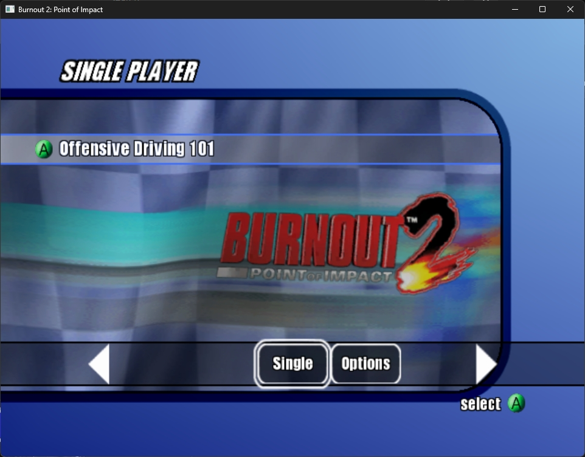
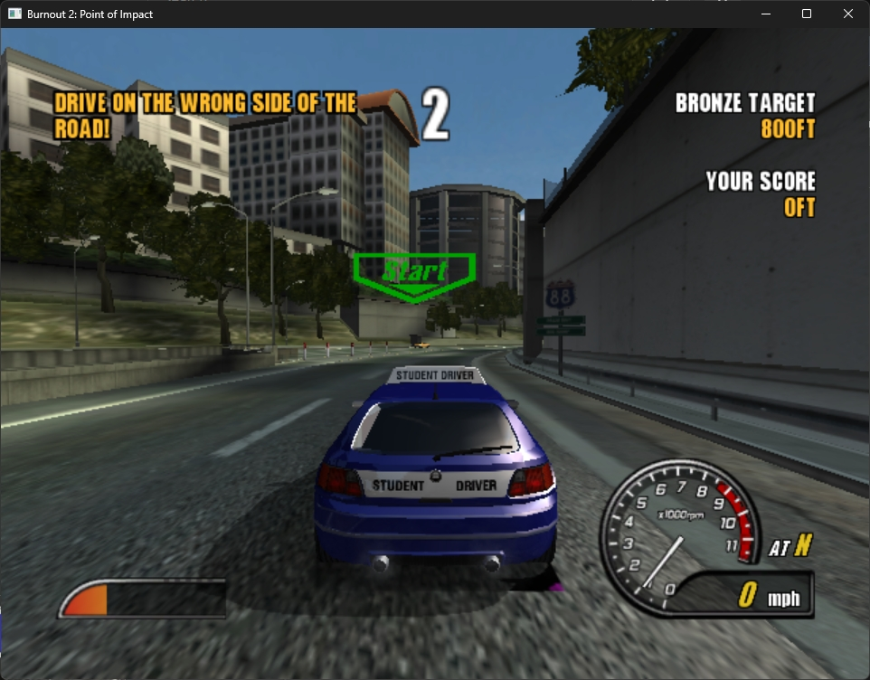

# Burnout 2: Point of Impact — Static Recompilation

An unofficial Windows version of the original Xbox game, focused on fast gameplay
and preserving its look and feel.

<i>Still in development: menus and the first driving lesson work. The rest of the
game is still being tested.</i>

## Screenshots

<p>
  
  
</p>

## What happened to the original release?

The original recompilation worked, but its poor performance and growing complexity
led to a fresh start. Its implementation was replaced with a smaller version
focused on speed and simplicity. I couldn't bear to keep the slop version public😅

## Current status

### What works

- Startup, menus and the first driving lesson, including driving, collisions and
  tested lesson transitions.
- Background music and menu sounds.
- Gamepad and keyboard input.
- Saved settings for display, audio and controls, with a selectable refresh rate
  that defaults to 60 Hz.

### What still needs work

- Remaining graphics glitches, including artifacts around car shadows and further
  checks of reflections against the original game.
- Testing all modes, tracks and saved-game progression.
- In-game sound effects.
- Checking sound balance and consistently smooth performance across the whole game.
- Custom control bindings and other settings.

## Getting started

You need a 64-bit Windows PC, a graphics card that supports DirectX 11, and your
own copy of the US Xbox release. Game files are not included.

Follow the [build instructions](BUILDING.txt) to create the app. Then, from the
project folder, run:

```powershell
.\build\windows\Release\b2.exe
```

In the settings window, choose your game's `default.xbe` file and Xbox disc image
(`.iso`), then click **Start game**. Press **Esc** to open or close settings, with
**General**, **Audio**, **Graphics** and **Controls** tabs. The game defaults to
**60 Hz**; choose another rate in General. Click **Save settings** to keep changes.

## Controls

Connected gamepads work automatically. Keyboard controls are enabled by default:

| Action | Key |
| --- | --- |
| Accelerate | W |
| Brake | S |
| Steer | A / D |
| Move through menus | Arrow keys |
| A button / Confirm | Space |
| B button / Back | Left Shift |
| Start / Pause | Enter |
| Toggle settings | Esc (or F1) |

<i>This is an independent fan project, unaffiliated with the game's owners.</i>
