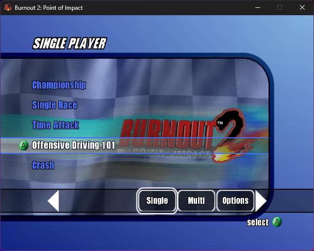
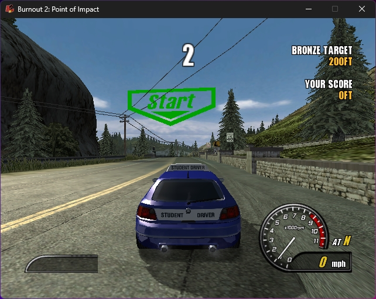

# Burnout 2: Point of Impact Static Recompilation

This repository is an experimental static recompilation of the Xbox release of
*Burnout 2: Point of Impact*. It lifts recovered IA-32 guest code into
deterministic native artifacts and rehosts the console boundaries for graphics,
audio, input, files, timing, threading, and memory.

> **Work in progress:** this is reverse-engineering research, not a finished
> source port or a ready-to-play release. The current Phase 7 IA-32 path is
> deliberately fail-closed when ahead-of-time coverage is incomplete. Expect
> missing features, correctness bugs, and performance below the
> original 60 Hz target.

## Development snapshots

| Frontend milestone | Lesson One milestone |
| --- | --- |
|  |  |

These maintainer-supplied screenshots document earlier visual milestones. They
show what the broader development runtime has rendered; they do not imply that
the current static-clean Phase 7 artifact can complete the same path today.
Game content is not included in this repository. The screenshots are excluded
from the MIT-licensed source and remain subject to their respective rights.

## Current status

Updated: August 9, 2026.

The current static IA-32 artifact boots from the XBE entry point, renders the
frontend, accepts controller input, and has manually reached gameplay with
visible 3D, menu/gameplay music, and corrected SFX attenuation. The retained
offline boundary audit resolves all 170 remaining guarded boundaries, adds
none, and pairs the eight complete 20-boundary milestones with eight generated
IA-32 runtime optimizations. The decoded-store audit also has zero unsupported
instructions.

The current artifact is
`ff8db42895b7970b554b9aa9fadaf62e82305e0946ca6f63b55b8ebd577936a4`.
It fixes a normal-live control-thunk/service-body address collision that made
the preceding zero-guard artifact open a black window and exit with
`0xC0000005`. Manual testing confirmed that the replacement renders and
continues beyond that first-vblank failure. A completed diagnostics-off
gameplay/performance capture is still required; this is not a 60 FPS claim.

The default `live_test.py` backend remains the diagnostic oracle. The
work-in-progress static backend must be selected explicitly with
`--guest-backend same-isa-ia32` and a verified normal-live artifact. It never
falls back to the oracle, an interpreter, a JIT, runtime compilation, or Python
guest callbacks.

| Area | Current state |
| --- | --- |
| XBE inspection and loader | Exact supported-build identity and deterministic mapping are implemented. |
| Analysis and decoded block store | Complete retained closure: 91,252 decoded records and zero unsupported audited instructions. |
| Static IA-32 backend | Phase 7 in progress; retained normal-live artifact has zero guarded boundaries and no runtime fallback path. |
| Host ABI and scheduling | Native primary, worker, vblank, filesystem, timing, memory, input, and 140 registered service paths. |
| Rendering | Vulkan frontend and gameplay 3D are manually confirmed; the latest first-vblank black-window regression is fixed. |
| Audio and input | Controller navigation, menu/gameplay music, and corrected gameplay SFX attenuation are manually confirmed; rumble and long-run continuity remain open. |
| Saves | Load/Save boundary coverage is closed statically; creation, restart/load, overwrite, and autosave still need end-to-end acceptance. |
| Performance | Eight boundary-budget optimizations are compiled into the backend; a current diagnostics-off 60 FPS measurement is still pending. |

The active correctness evidence and limitations are summarized in
[docs/VALIDATION.md](docs/VALIDATION.md). The ignored local Phase 7 handoff
contains address-level continuation details for developers working in the same
workspace.

## Project rules

- Supply your own legally obtained Xbox copy.
- Do not commit or distribute disc images, extracted files, XBE sections, Xbox
  SDK material, generated title code/data, render captures, or local reports.
- The only screenshot exception is the small, maintainer-approved documentation
  set under `docs/images/`; see [docs/ASSET_POLICY.md](docs/ASSET_POLICY.md).
- Guest code used by normal execution must be decoded, lifted, and compiled
  ahead of time. Unknown targets remain coverage gaps.
- Normal gameplay must report zero Python runtime callbacks, frontier
  interpretation, runtime decoding/compilation, native promotion, and automatic
  cross-backend fallback.
- Input used for title-path evidence is manual; repository tools must not
  automate gameplay navigation.
- Prefer observed behavior, exact ABI evidence, and bounded family recovery over
  title-specific guesses or broad runtime fallbacks.

Project-authored source is MIT licensed. Original game content, screenshots,
trademarks, and third-party components are not. See [LICENSE](LICENSE),
[NOTICE.md](NOTICE.md), and [docs/ASSET_POLICY.md](docs/ASSET_POLICY.md).

## Quick start

The supported development host is Windows x86-64. Install the locked Python
dependencies:

```powershell
python -m pip install --requirement .\requirements-dev.lock
```

Install the extraction tool and extract your legally obtained local image:

```powershell
.\tools\extract\install_extract_xiso.ps1
python .\tools\extract\extract_disc.py `
  --iso ".\Burnout 2\Burnout 2 - Point of Impact (USA).xiso.iso"
```

Verify the target and run the changed-file-aware development gate:

```powershell
python .\tools\project_identity.py `
  .\data\local\extracted\burnout_2_poi_usa\default.xbe `
  --pretty
python .\tools\dev_check.py --explain
```

Launch the established diagnostic runtime:

```powershell
python .\tools\playability\live_test.py
```

After producing a verified normal-live artifact from local retained evidence,
launch the work-in-progress static backend explicitly:

```powershell
python .\tools\playability\live_test.py `
  --guest-backend same-isa-ia32 `
  --ia32-artifact .\build\local\ia32-live\manifest.json `
  --skip-host-build
```

Do not use `--developer-live-compile` for ordinary execution or validation.
Setup, local paths, controls, and the exact distinction between the two launch
modes are in [docs/GETTING_STARTED.md](docs/GETTING_STARTED.md).

## Runtime model

The Phase 7 static path uses three ownership layers:

1. Python verifies local inputs, builds or selects deterministic artifacts,
   launches native processes, and composes post-run diagnostics.
2. A 32-bit native guest process owns AOT guest dispatch, scheduler lanes,
   reached service bodies, dirty-memory ownership, controller consumption,
   filesystem operations, render publication, and audio decode/mix/publication.
3. A native 64-bit presenter process owns SDL3 window/input/audio integration
   and Vulkan rendering. Versioned shared-memory records and native events carry
   control, command, resource, and PCM publications.

The normal static path does not execute guest code in Python. Developer audits
and frozen replay tools may use isolated diagnostic paths, and their reports
must identify that mode explicitly. See [docs/ARCHITECTURE.md](docs/ARCHITECTURE.md).

## Documentation

| Document | Purpose |
| --- | --- |
| [Getting started](docs/GETTING_STARTED.md) | Requirements, local data, target verification, launch modes, and controls |
| [Architecture](docs/ARCHITECTURE.md) | Offline/static boundary, native ownership, transports, and fail-closed rules |
| [Building](docs/BUILDING.md) | Locked toolchain, validation ladder, AOT artifact generation, and maintenance |
| [Debugging commands](docs/DEBUGGING_COMMANDS.md) | Fault triage, manual capture, exact audits, replay, and address lookup |
| [Profiling](docs/PROFILING.md) | ETW/WPA, GPUView, RenderDoc, and evidence-labeling protocol |
| [Validation evidence](docs/VALIDATION.md) | Current acceptance, historical milestones, and open limitations |
| [Asset policy](docs/ASSET_POLICY.md) | Proprietary-content boundary and documentation-screenshot exception |
| [Contributing](CONTRIBUTING.md) | Change discipline and required checks |

## Repository layout

```text
docs/             Project documentation and approved README images
runtime/
  host/           Presenter, Vulkan renderer, transports, and diagnostics
  nv2a/           Dependency-light NV2A decoding and conversion support
  platform/sdl/   SDL3 window, input, audio, and Vulkan-surface integration
  xbox/           Xbox runtime and hardware shims
tools/
  analysis/       Project-owned analysis database
  extract/        Local disc extraction
  host/           Presenter build and smoke wrappers
  loader/         XBE mapping and loader tools
  playability/    Live launcher, probes, audits, and reports
  profiling/      System-profiler orchestration
  recomp/         IA-32 lifting, static artifacts, proofs, and execution
  render/         D3D8/NV2A stream normalization
  xbe/            XBE inspection
tests/unit/       Python unit and regression tests
tests/native/     Asset-free C++/CTest regressions
```

`data/local/`, `reports/local/`, build/cache directories, extracted game
content, generated native modules, and recovered streams are local-only and
ignored.
